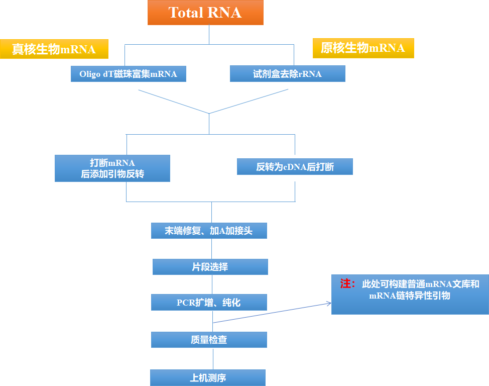
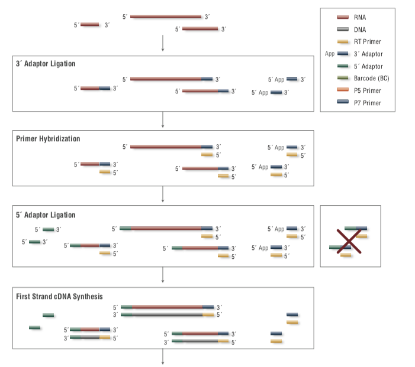
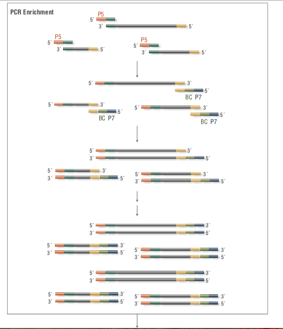
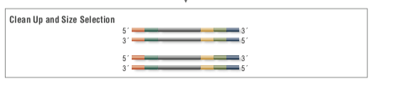
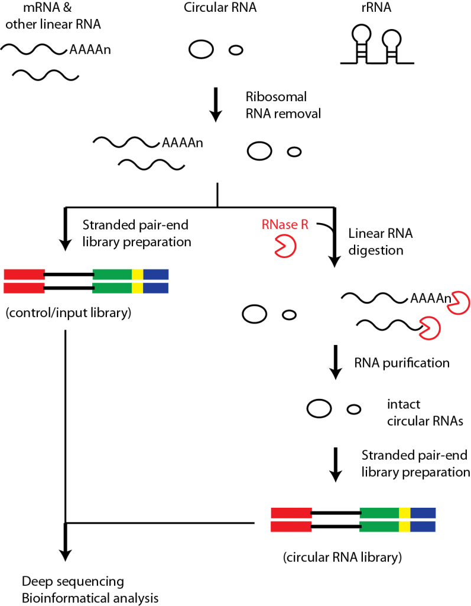

# How to do RNA-seq

> 目前二代测序仪的厂商有很多家，但核心的原理大同小异，基本都是利用高通量测序获取样品中RNA的序列信息；本节将以市场占有率最高的Illumina测序平台为例，简单介绍我们提取的RNA是如何变成测序文库

## 0. NGS, Next Generation Sequencing 

* Illumina Sequencing by Synthesis [Video](https://www.youtube.com/watch?v=fCd6B5HRaZ8)

* NGS流程

## I. 转录组测序种类

## II. RNA-seq

### 1. RNA-seq原理

* RNA-seq (RNA Sequencing)，也被称为全转录物组散弹枪法测序 Whole Transcriptome Shotgun Sequencing (WTSS), 是基于第二代测序技术的转录组学研究方法

* RNA-Seq可使研究人员在单次分析中检测已知的和**新的特征，使检测转录本亚型、基因融合、单核苷酸位点变异和其他特征不受先验知识的限制**

### 2. RNA-seq建库

* 建库流程

* 建库产物

### 3. RNA文库类别

* **polyA-seq（mRNA and polyA-lncRNA）: polyA & oligo(dT) priming**

* **Total RNA-seq: rRNA depletion and random primers enrichment**

* **small RNA-seq: adaptors ligation**

* **circRNA-seq: RNase R降解掉线性RNA分子，再用random primer富集环状RNA分子**

## III. Appendix: RNA content

## IV. References

[Illumina官网](https://www.illumina.com.cn/techniques/sequencing/rna-sequencing.html)

[Illumina-For all you seq](https://cloud.tsinghua.edu.cn/f/bd7e07a9abf647f083c4/)

[Illumina RNA sequencing methods review](https://cloud.tsinghua.edu.cn/f/d6ac4a1c37004acaa7d4/)

[Illumina sequencing introduction](https://cloud.tsinghua.edu.cn/f/286142b9fc27440b8b2e/)

[Illumina文库制备和芯片试剂盒选择器](https://www.illumina.com.cn/library-prep-array-kit-selector.html)

[聊聊转录组测序（知乎）](https://zhuanlan.zhihu.com/p/26319993)

