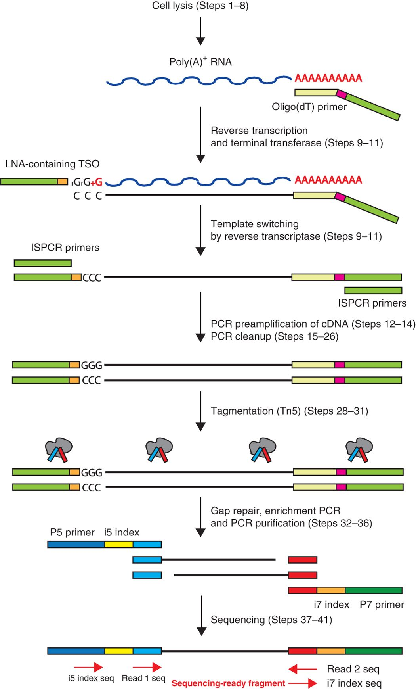

# What is SMART-seq2 and Multiplex

## I. SMART-Seq2

> Switching Mechanism At 5' end of the RNA Transcript

### 1. 发展历程

* 2012年Smart-Seq发表 (Ramsköld et al., 2012, Nature Biotechnology)

* 2013年发表了其改进技术的应用Smart-Seq2 (Picelli et al., 2013, Nature Methods)

* 2014年Smart-Seq2 protocol发表 (Picelli et al., 2014, Nature Protocol)

### 2. 原理 

> Step-by-step library generation

#### a. Poly(A)+ RNA逆转录（Reverse transcription and terminal tranferase）

* oligo-dT经过退火结合到mRNA的poly(A)，逆转录酶MMLV开始进行逆转录

* **逆转录完成后，MMLV的末端转移酶活性会在3'末端增加额外的C**

#### b. 模板转换（Template switching）

* 加入TSO引物，TSO3'末端的rGrG+G结合到第一链的CCC，**第一链（非模版链）继续延伸合成TSO的互补链**

* TSO引物的3'末端有2个核糖鸟苷(rG)和一个LNA修饰的鸟苷(+G)，这样的设计使LNA单体的热稳定性增强，其退火温度的升高可以增强非模板cDNA的3'延伸能力

#### c. cDNA扩增（PCR preamplification）

* 添加ISPCR单引物用于cDNA扩增

* 这步得到全长的cDNA序列

#### d. cDNA片段化（Tagmentation）

* 利用Tn5的特性把cDNA打断的同时，把P5/P7整合到打断后的cDNA片段上

#### e. 文库扩增（PCR enrichment）

* 加入P5 and P7 index引物对上一步标签化的文库进行扩增

#### f. 上机测序（Sequencing）

### 2. Smart-seq2的改进 

* Smart-Seq2 对原始的Smart-Seq实验流程进行了多项改进优化，它不再需要纯化步骤，可大大提高产量，最重要的改进是下面两项：

  * TSO 3'端最后一个鸟苷酸替换为**锁核酸LNA**(locked nucleic acid)，LNA单体的热稳定性增强，其退火温度增强非模板cDNA的3'延伸能力
  * 甜菜碱（一种具有两个重要作用的甲基供体：它会增加蛋白质的热稳定性，并通过破坏DNA螺旋来降低甚至消除了DNA热融变对碱基对组成的依赖性）与较高的MgCl2浓度结合使用，解决某些RNA形成二级结构（例如发夹或环）由于空间位阻，可能导致酶终止链延长的问题

### 3. Smart-Seq2优点

* Smart-seq2利用现成的试剂比广泛商用的SMARTer kit生产的文库质量更高，成本便宜~12%，为分析大量细胞提供了可能性

* 相对于截短的cDNAs，**M-MLV逆转录酶更倾向于选择全长cDNAs**作为其末端转移酶活性的底物。因此每个转录本的所有外显子都能被检测到，这使它可以用于检测可变剪接，还可以在转录本层面进行全面的SNP和突变分析，扩大了其应用范围

* Smart-seq2的方案组分和原理是公开的，让研究人员可以进一步对其进行改良，目前在这个方案基础上涌现了许多单细胞测序的新成果

### 4. Smart-Seq2限制

* 由于对聚腺苷酸化的RNA具有选择性，所以**不能分析非poly(A)的RNA**

### 5. Appendix--接头和引物序列

* oligo-dTV：
5'- AAGCAGTGGTATCAACGCAGAGTACTTTTTTTTTTTTTTTTTTTTTTTTTTTTTTVN -3'

* Template Switching Oligo (TSO)：
5'- AAGCAGTGGTATCAACGCAGAGTACATrGrG+G -3'

* ISPCR：
5′- AAGCAGTGGTATCAACGCAGAGT -3′

* Nextera Tn5 binding site (19-bp Mosaic End)：
5'- AGATGTGTATAAGAGACAG -3'

* Nextera N/S5xx primer entry point (s5)：
5'- <u>TCGTCGGCAGCGTC</u> -3'

* Nextera N7xx primer entry point (s7)：
5'- GTCTCGTGGGCTCGG -3'

* Illumina P5 adapter：
5'- AATGATACGGCGACCACCGAGATCTACAC -3'

* Illumina P7 adapter：
5'- CAAGCAGAAGACGGCATACGAGAT -3'

* Nextera (XT) N/S5xx Index primer：
5'- AATGATACGGCGACCACCGAGATCTACAC[8-bp i5 index]<u>TCGTCGGCAGCGTC</u> -3'

* Nextera (XT) N7xx Index primer：
5'- CAAGCAGAAGACGGCATACGAGAT[8-bp i7 index]GTCTCGTGGGCTCGG -3'

* Read 1 sequencing primer：
5'- <u>TCGTCGGCAGCGTC</u>AGATGTGTATAAGAGACAG -3'

* Index 1 sequencing primer：
5'- CTGTCTCTTATACACATCTCCGAGCCCACGAGAC -3'

* Read 2 sequencing primer：
5'- GTCTCGTGGGCTCGGAGATGTGTATAAGAGACAG -3'

## II. Multiplex

### 1. 原理

Multiplex sequencing：多重测序，使用 **barcode(条形码/标签)** 来区分样品，增加每次运行的样本数量，通过识别barcode序列，可以区分多种不同的样品，在研究基因组的特定区域或小型基因组时，样本多重分析十分有用，**更短的时间，更多的样本**

### 2. 优势

* **快速**的高通量策略：每次实验可同时对大量样本进行测序

* **经济高效**的方法：通过节省时间和试剂，样本混合提高了生产力

### 3. 方法

* Barcode样品条形码扮演着标识符或标签的作用，以确定读出序列来源于哪个样品

* Barcode通常是在 DNA 测序前加入的特异性短序列，这些条形码会与未知样品DNA/RNA序列一同被测序

* 测序结束后，将读出序列按照barcode进行分类和重组

## III. References

* [Ramsköld D, et al. Full-length mRNA-Seq from single-cell levels of RNA and individual circulating tumor cells. 2012. Nature biotechnology.](https://cloud.tsinghua.edu.cn/f/579a5688924b4a0eb6d5/)

* [Picelli S, et al. Smart-seq2 for sensitive full-length transcriptome profiling in single cells. 2013. Nature methods.](https://cloud.tsinghua.edu.cn/f/c9965e66be114d24bc40/)

* [Picelli S, et al. Full-length RNA-seq from single cells using Smart-seq2. 2014. Nature protocols.](https://cloud.tsinghua.edu.cn/f/fee6542b6a9041708a05/)

* [Illumina Sample Multiplexing Overview](https://www.illumina.com/science/technology/next-generation-sequencing/plan-experiments/multiplex-sequencing.html)
