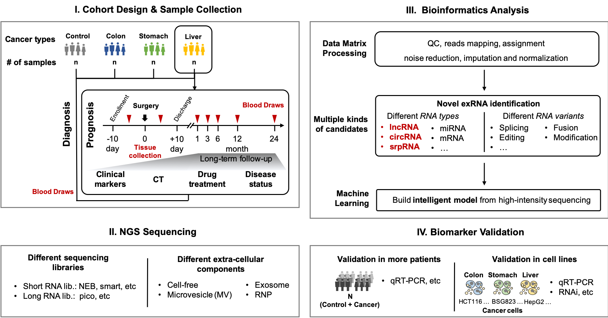

# Lab Training for Precision Medicine

## [FAQ](FAQ.md)

## Class I. Basics

1. [Safety](../wetlab_safety)  
2. [Regulation](../wetlab_regulation)   
3. [Protocols](https://github.com/lulab/intranet/blob/master/wetlab_protocol/README.md)Private
4. [How to design sample cohort](Class-1_Basics/4.How to design sample cohort.md)
5. [How to collect and manage samples](Class-1_Basics/5. How to collect and manage samples.md)
6. [How to purify RNA from blood](Class-1_Basics/6. How to purify RNA from blood.md)
7. [How to check the quantity and quality of RNA](Class-1_Basics/7. How to check the quantity and quality of RNA.md)
8. [RNA storage](Class-1_Basics/8. RNA storage.md)
9. [How to remove DNA contanimation](Class-1_Basics/9. How to remove DNA contanimation.md)
10. [What is Spike-in](Class-1_Basics/10. What is Spike-in.md)

## Class II. NGS I

1. [How to do RNA-seq](Class-2_NGS-I/How to do RNA-seq.md)
2. [How to check the quantity and quality of RNA-seq library](Class-2_NGS-I/How to check the quantity and quality of RNA-seq library.md)
3. [What is Smart-seq2 and Multiplex](Class-2_NGS-I/What is Smart-seq2 and Multiplex.md)

## Class III. NGS II

* [1. How to do Pico]()
* [2. How to improve Pico]()
  * 2.1 Replace pico kit by other independent reagents
  * 2.2 Introduce UMI & barcode into pico system
  * 2.3 Remove ribosomal cDNA by DASH/CRISPR method

## Class IV. Validation

* [1. How to find and select candidates]()
  * [1.1 Differential Expression](https://lulab2.gitbook.io/teaching/part-iii.-ngs-data-analyses/2.rna-seq/2.1.differential-expression)
  * [1.2 Alternative Splicing](https://lulab2.gitbook.io/teaching/part-iii.-ngs-data-analyses/2.rna-seq/2.2.alternative-splicing)
* [2. How to find controls and references]()
* [3. How to do qRT-PCR]()
  * 3.1 How to select qPCR strategy
  * 3.2 How to reverse transcrip RNA to cDNA
  * 3.3 How to design qPCR plate
  * 3.4 How to minish qPCR error between replicats
  * 3.5 How to analysis qPCR results
* [4. How to do ddPCR]()
* [5. More validation methods]()
  * Alternative splicing: Agilent 2100 or gel electrophoresis

## Class V. Patent and License 

1. How to design different cohorts
2. How to prepare paperwork
3. How to prepare testing kit

## APPENDIX

1. Common laboratory instruments
2. Frequently-used reagents and consumables

